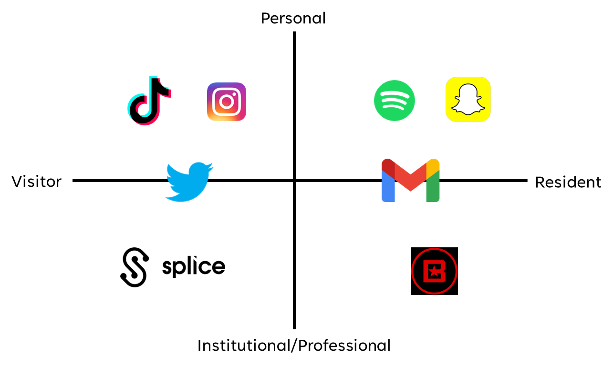

# Can Hip-Hop Artists use their Digital Profiles to have a Positive Effect on Existential Risks?
## How can you interact with the internet?
When you interact with the internet you will have a digital identity. Your digital identity can be organised into personal, institutional/professional, visitor, and resident. However, your digital identity on a particular website does not necessarily have to be exclusive to one of these. A good way of visualising your digital identities is through a Virtual Residence Map, as shown below.

For this project I have made a short YouTube video linking musical artists' digital profiles to existential risks, and if they can use their digital profiles to have a positive effect on existential risks. In this project I also delve into specific songs by hip-hop artists and how, through their art, they try to tackle existential risks such as systematic racism, and racism as a whole. You can find this video below.

<iframe width="560" height="315" src="https://www.youtube.com/embed/3Rc3prHHmiA" title="YouTube video player" frameborder="0" allow="accelerometer; autoplay; clipboard-write; encrypted-media; gyroscope; picture-in-picture; web-share" allowfullscreen></iframe>
